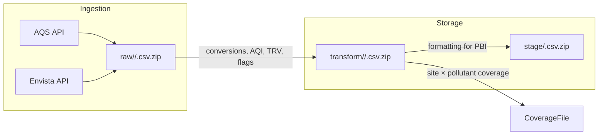

# Air Quality Data Pipeline – Single‑Source Clarification

---

> **Audience** Any developer, analyst, or reviewer joining the project. Treat this file as the authoritative reference. No detail from the client material has been omitted.

---

## 1 Project Summary

An automated **Python** data‑pipeline will feed an *Air Quality Dashboard* (Power BI). The pipeline must run **locally on Windows** without special installation and save all outputs as **CSV files (compressed as **``**) in OneDrive‑synced folders** ready for Power BI **folder connectors**.

Core functions:

1. **Ingest** air‑quality data from two sources\
      • **Primary:** US EPA AQS API\
      • **Fallback / supplemental:** Envista API
2. **Store** data in three persistent layers per pollutant *(year‑partitioned)*\
      `raw/` → `transform/` → `stage/`
3. **Transform** raw measurements (unit conversion, standardisation, AQI, TRV, wildfire flags, etc.).
4. **Stage** Power BI‑optimised datasets and a **monitor‑coverage file**.
5. **Log** successes, updates, and errors.

---

## 2 Stakeholders & Working Mode

| Role                         | Name / Org | Notes                                           |
| ---------------------------- | ---------- | ----------------------------------------------- |
| Product‑owner & main contact | *Client*   | Provides input files, tests code locally.       |
| Backend developer            | **You**    | Work in your own environment, commit to GitHub. |

Collaboration rules:

- Use the provided GitHub repo; commit early & often with clear messages.
- Structure code as shown in §8.
- Dependencies listed in `requirements.txt`.
- All secrets (.env) **excluded** from version control.

---

## 3 Data Architecture & Flow



### 3.1 Layers

| Layer                                                             | Retention                                     | Contents                                           | Notes                           |
| ----------------------------------------------------------------- | --------------------------------------------- | -------------------------------------------------- | ------------------------------- |
| **Raw**                                                           | • AQS: full history **2000 → present**        |                                                    |                                 |
| • Envista: keep everything collected (initial backfill 1‑2 years) | • Hourly sample & daily / annual summaries    |                                                    |                                 |
| • Exact copy of source units/flags                                | Golden record; never overwrite existing rows. |                                                    |                                 |
| **Transform**                                                     | Mirrors Raw                                   | • Unit conversion (e.g., ppm → µg/m³)              |                                 |
| • Standardised columns & datatypes                                |                                               |                                                    |                                 |
| • Computed: AQI, TRV exceedance, wildfire flags (HMS KML)         | One‑row‑per‑measure granularity.              |                                                    |                                 |
| **Stage**                                                         | Mirrors Raw                                   | • Star‑schema‑ready fact & dimension CSVs (see §6) | Only layer queried by Power BI. |

---

## 4 Data Sources

### 4.1 AQS API (Primary)

- **Key:** developer requests at [https://aqs.epa.gov/…/signup](https://aqs.epa.gov/…/signup). (Takes a few days.) Store as `AQS_EMAIL` and `AQS_KEY` in `config/.env`.
- **Pull window:** **2000 → today**, backfilled once then incremental daily.
- **Endpoints used** (all v2):

| Purpose        | Endpoint             | Example                                                                     |
| -------------- | -------------------- | --------------------------------------------------------------------------- |
| Site metadata  | `/monitors/bySite`   | …` param=42401&bdate=20150501&edate=20150502&state=15&county=001&site=0007` |
| Hourly samples | `/sampleData/bySite` | …`param=44201&bdate=20170618&edate=20170618&state=37&county=183&site=0014`  |
| Daily summary  | `/dailyData/bySite`  | …                                                                           |
| Annual summary | `/annualData/bySite` | …                                                                           |

Returned JSON fields are listed in the client notes and must be preserved in Raw.

### 4.2 Envista API (Fallback / Supplement)

- **Use case**\
    1 Latest O₃ & PM readings when AQS has latency.\
    2 Additional pollutants absent from AQS.
- **Auth & host**\
    Credentials **not provided**; implement token/basic auth placeholders and let the client test locally.
- **Key endpoints** (REST v1):

| Endpoint                                              | Description                                                 |
| ----------------------------------------------------- | ----------------------------------------------------------- |
| `/v1/envista/regions`                                 | Region list                                                 |
| `/v1/envista/stations`                                | Station metadata incl. monitors                             |
| `/v1/envista/stations/{station_id}/data/{channel_id}` | Hourly data. Params `from`, `to`, `timebase` (e.g., 60 min) |

- **Fields per observation**\
    `datetime, channel_id, value, status, valid, description, parameter, units_of_measure, method_code, latitude, longitude, site, qualifier, sample_frequency`.

- **Fallback logic**\
    For each hour/pollutant: *if AQS sample is missing* → use Envista value and flag source.

---

## 5 Transformations

| Category                                                       | Details                                                                  |               |
| -------------------------------------------------------------- | ------------------------------------------------------------------------ | ------------- |
| **Unit conversion**                                            | ppm/ppb → µg/m³ or as required.                                          |               |
| **Standardisation**                                            | Column names snake\_case; consistent dtypes; missing values as `NaN`.    |               |
| **Computed metrics**                                           | • **AQI** per EPA breakpoints (`dimAQI`)                                 |               |
| • **TRV**: Toxicity Reference Value comparison (table pending) |                                                                          |               |
| • Wildfire event flag using HMS KML overlay.                   |                                                                          |               |
| **QC & flags**                                                 | Preserve `qualifier`, `simple_qual`, `valid`, add `data_source` (`"AQS"` | `"Envista"`). |

---

## 6 Stage Layer → Power BI Model

> *All stage CSVs compressed as **`.zip`**; same timestamp/time‑zone handling as legacy R scripts.*

### 6.1 Fact tables

- `fctAQIDaily` Daily AQI by pollutant × site × date
- `fctAQICategory` Count of days in each AQI category by city × year
- `fctO3Hourly`, `fctPM25Hourly`, `fctPM10Hourly`, `fctOtherPollutantsHourly`, `fctBCHourly`
- `fctToxicsAnnual`, `fctToxicsDaily`
- `fctEmissionsCounty`, `fctEmissionsCensusTract`, `fctEmissionsATEI`
- `fctATSRiskCounty`, `fctATSRiskTract`, `fctATSConcentrationsTract`
- `fctNOXSat`, `fctHourlyPAMS`, `fctEightHourPAMS`, `fctHourlyMet`, `fctWildfireFlags`

### 6.2 Dimension tables

`dimDate, dimSites, dimPollutant, dimCounty, dimCensusTract, dimTRV, dimAQI, dimSourceCategory`

### 6.3 Granularity requirements

- **Hourly, daily, and annual** outputs are all required.
- Timestamp time‑zone handling **must replicate the behaviour in existing R scripts** (local vs UTC not re‑specified).

---

## 7 Folder & File Naming

- **Compression:** `.zip` for every CSV.
- **Year partitions:** `raw/<pollutant>/<pollutant>_<year>.csv.zip` (e.g., `raw/pm25/pm25_2025.csv.zip`).
- **Transform & stage** mimic same pattern or table name.
- **Monitor‑coverage file:** `stage/monitor_coverage.csv.zip`.
- Time‑zone inside filenames **TBD** (await client). Stick to R precedent.

---

## 8 Repository Layout & Coding Standards

```text
repo/
├─ scripts/
│  ├─ ingestion/
│  │  ├─ aqs_fetch.py
│  │  ├─ envista_fetch.py
│  │  └─ scheduler.py
│  ├─ transform/
│  │  ├─ converters.py
│  │  ├─ metrics.py  # AQI, TRV
│  │  └─ wildfire_overlay.py
│  ├─ stage/
│  │  └─ exporter.py
│  └─ utils/
│     ├─ logging_setup.py
│     ├─ file_ops.py
│     └─ naming.py
├─ reference/          # client‑supplied sheets, cross‑walks, etc.
├─ docs/
│  └─ adr/draft.md
├─ logs/
├─ config/
│  └─ .env.template
├─ README.md
└─ requirements.txt
```

### 8.1 Logging

- Use `logging` module; rotate daily; level INFO+.
- Log file path: `logs/pipeline_<YYYYMMDD>.log`.

### 8.2 Naming convention (agreed 11‑Dec‑2024)

1. **Variables & parameters:** `lowercase_with_underscore`
2. **Functions:** `camelCase` (e.g., `createDate`, `calculateAqi`)
3. Avoid ambiguous abbreviations; use full descriptive names.
4. Prefix booleans with `is`, `has`, etc.; suffix numerics with `min`, `max`, etc.
5. Replace magic numbers with named constants (e.g., `MAX_RETRY_COUNT = 5`).
6. Plural names for collections (`station_ids`).
7. Keep names short **but** understandable.
8. Maintain consistency across the codebase.

---

## 9 Configuration & Setup

1. **Clone repo** and create virtual‑env:

   ```bash
   python -m venv venv
   source venv/Scripts/activate  # PowerShell on Windows
   pip install -r requirements.txt
   ```

2. **Populate **`` (copy `config/.env.template`):

   ```env
   # AQS
   AQS_EMAIL=<your_email>
   AQS_KEY=<your_key>
   # Envista
   ENVISTA_BASE_URL=https://<host>/api/
   ENVISTA_USERNAME=<user>
   ENVISTA_PASSWORD=<pass>
   ```

3. **Run pipeline**

   ```bash
   python -m scripts.ingestion.scheduler   # orchestrates full flow
   ```

*The client will execute the same on their local Windows machine.*

---

## 10 Resolved Q&A (24‑Jun‑2025)

| ID      | Decision                                                                              |
| ------- | ------------------------------------------------------------------------------------- |
| **1.1** | Developer must request own AQS key (free, 2‑3 days).                                  |
| **1.2** | Pull AQS data starting **year 2000** forward. Backfill earlier years later if needed. |
| **1.3** | Envista auth & host withheld; developer codes placeholders; client tests.             |
| **1.4** | Envista raw layer keeps **all** data (no rolling window).                             |
| **1.5** | Final pollutant list **TBD** (client will supply).                                    |
| **2.1** | Raw output **CSV** (not JSON).                                                        |
| **2.2** | Filename time‑zones **TBD**; follow R precedent.                                      |
| **2.3** | Compression format: ``.                                                               |
| **3.2** | Latest TRV table will be supplied by client.                                          |
| **3.3** | Wildfire overlay: continue using **HMS KML**.                                         |
| **4.1** | Stage schema: sheet with details now provided in repo.                                |
| **4.2** | Dashboard granularity: **hourly, daily, annual** tables required.                     |
| **4.3** | Stage timestamp TZ must mirror R scripts.                                             |

---

## 11 Outstanding Items

| Needed from Client                             | Status                                |
| ---------------------------------------------- | ------------------------------------- |
| Envista auth details & base URL                | Pending (client‑side testing for now) |
| Final pollutant list & codes                   | Pending                               |
| Latest TRV benchmark table                     | Pending                               |
| Confirmation of filename TZ convention         | Pending                               |
| Any additional ADR updates (docs/adr/draft.md) | Pending                               |

---

## 12 References

- Existing R scripts: `reference/airquality/…`
- AQS API docs: [https://aqs.epa.gov/aqsweb/documents/data\_api.html](https://aqs.epa.gov/aqsweb/documents/data_api.html)
- pyaqsapi library: [https://github.com/USEPA/pyaqsapi](https://github.com/USEPA/pyaqsapi)

---

*End of document*

